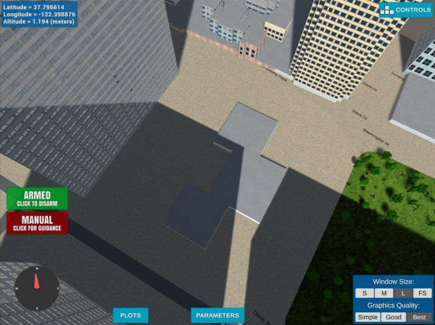
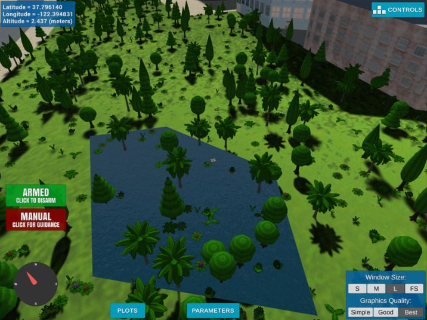
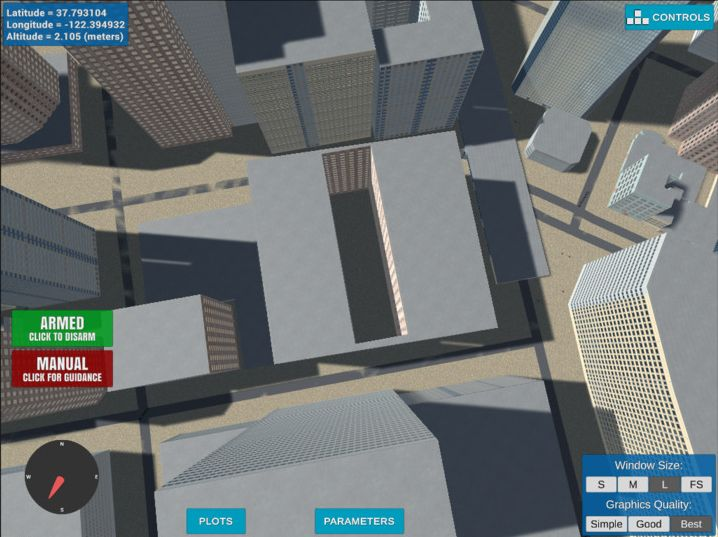

# Waypoint Locations

Some of the spots picked for testing the planning algorithms.
The waypoints labeled as "optional" require additional effort
in the planner as they involve flying over obstacles.

Note that these locations do not reflect reality and you should
absolutely not every try to fly your drone there in real life.

## 37.792405 north, -122.398908 east, 10.0 m

A junction just around the corner of the starting location. This
should help testing the planner quickly, as planning long distances
still takes a while on the grid. The altitude is just the default
target altitude of the starter code.

## 37.796612 north, -122.398877 east, 1.0 m

This spot should be trivially reachable even at low altitudes.

## 37.787681 north,-122.399856 east, 1.0 m (optional)

This spot requires flying over a low building. At an altitude
of 10 m, it should be reachable.

## 37.796141 north,-122.394831 east, 2.5 m (optional)

This spot is over a lake surrounded by trees. While it should
be reachable at reasonable altitudes, the safety margin to the
surrounding trees may render this position impossible to 
plan a path to.

## 37.793106 north, -122.394933 east, 1.0 m (optional)

This spot is in a backyard fully enclosed by a building. In order
to get here, the drone needs to fly at an altitude of about 70 meters.

Note that this position is just next to the starting location
and shows the [simulator bug](https://github.com/udacity/fcnd-issue-reports/issues/392)
mentioned in [README.md](README.md) (the long, flat building in 
the upper right quarter of the image, right on top of Market Street).

## 37.790642 north, -122.397818 east, 1.0 m

When visiting each waypoint, this spot is reasonably close to the
previous building. Depending on how we design the cost for flying
at high(er) altitudes, the planner may either choose to stay high,
then go down (passing over some buildings), or go low and follow
along at street level.
If we skip the "optional" waypoints it is just south of the first
waypoint, and the drone needs to only bypass some high-storied buildings.

