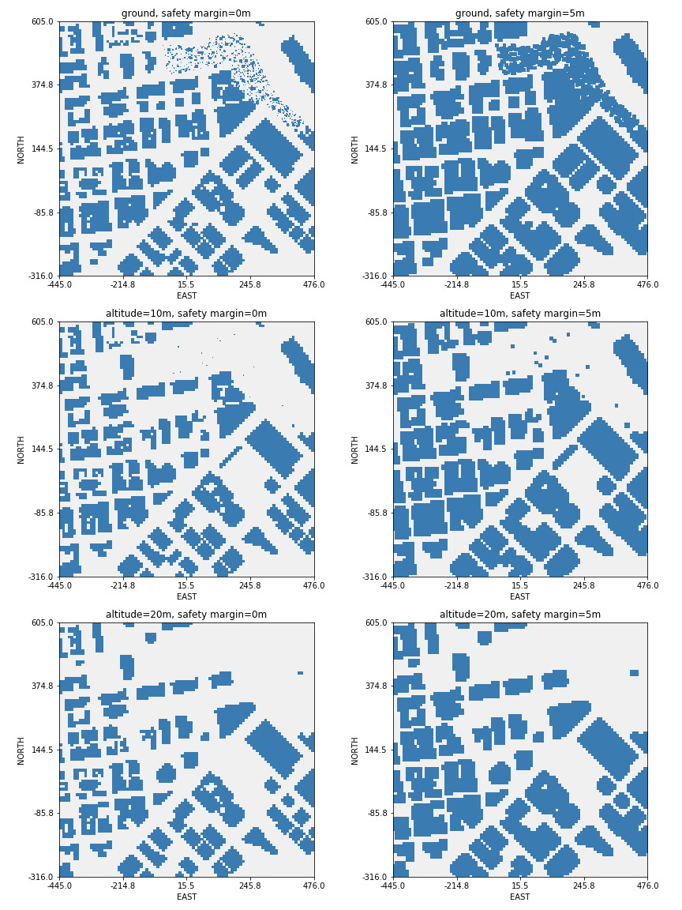
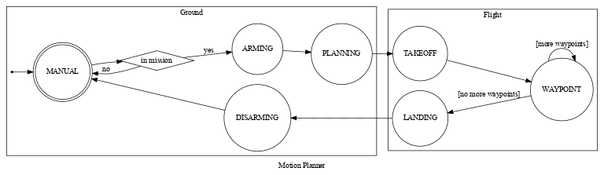
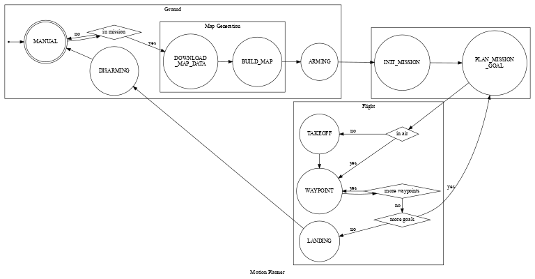
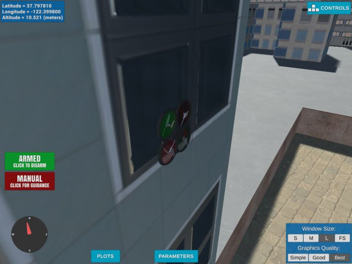

# FCND - 3D Motion Planning


This project is a continuation of the [Backyard Flyer](https://github.com/sunsided/FCND-Backyard-Flyer)
project where we executed a simple square shaped flight path. 
It integrates techniques to plan a path through an urban environment. Check out the [project rubric](RUBRIC.md)
([original link](https://review.udacity.com/#!/rubrics/1534/view)) for more detail on how this implementation
is differing from the starter code forked off the [original repo](https://github.com/udacity/FCND-Backyard-Flyer).

## Before we start: A word of caution

As of version 0.1.0 and 0.1.1, the Udacity-provided simulator is broken on Linux (at least on 
Ubuntu 18.04, 20.04, but reportedly on some Windowses as well). Once you load the scene,
a building is spawned right on top of your drone. Every move immediately results in a crash,
which throws off the physics. There's a multitude of reports, some of them you can find here:

- [udacity/fcnd-issue-reports#392](https://github.com/udacity/fcnd-issue-reports/issues/392)
- [Udacity Knowledge: Is the drone supposed to spawn inside a building?](https://knowledge.udacity.com/questions/87322) 
  (Spoiler alert: no.)
- [Udacity Knowledge: How to change the spawn location of the drone in Simulator?](https://knowledge.udacity.com/questions/91857)
  (Spoiler alert: you can't.)

## Python environment

This project is running in a simulated environment. You can download the Linux version of the simulator from from the
releases of the [sunsided/fcnd-notebooks](https://github.com/sunsided/fcnd-notebooks) GitHub repo.

The code was implemented against the Conda environment described in `environment.yml`. To recreate the environment,
run

```bash
conda env create -f environment.yml
```

After that, activate it using

```bash
conda activate udacity-fcnd
```

## Running the code

Start the simulator and select the _Motion Planning_ scene. Once the scene is initialized,
execute the Python code by running

```bash
python motion_planning.py
```

Note that the file `backyard_flyer.py` is the solution to the [Backyard Flyer](https://github.com/sunsided/FCND-Backyard-Flyer)
project and is meant to be run against the _Backyard Flyer_ simulator scene.
It is kept here for reference, as the project rubric requires it.

## Your friend, the map

The simulator scene is modeled after Downtown San Francisco with the
starting location somewhere around [Market Street](https://goo.gl/maps/Ka4fKuYARDVT5aAM8)
(map code `QJV3+57`). Here's an aerial picture of the environment:


As far as the planner is concerned, the map is initially discretized into
a grid. With height information added in, it looks like this:


Note that the height scale in this plot is dimensionless
(no specification is available for `colliders.csv`), but can
be assumed to be in meters.

During discretization, we are free to choose any minimum flying
altitude, as well as any safety margin to obstacles such as buildings
and trees. The following picture shows different variations of the altitude
(0m, 10m and 20m), as well as the safety margin (5m and 10m); in these
plots, bright spaces resemble safe areas to fly, whereas darker blue areas resemble
inadmissible areas:



## Project Description

### Starter Code

As mentioned above, `motion_planning.py` is based on the `backyard_flyer.py` solution
which, itself, involves taking off, flying a square, then landing safely.

As before, waypoints are calculated exactly once in the beginning of the mission.
In both solutions, they are issued individually by calling the `Drone` class' `cmd_position(north, east, altitude, heading)`;
here however, we're now sending off an entire list of waypoints in addition for visualization 
by calling `send_waypoints()`. This, in turn, makes use of a somewhat undocumented
functionality of the underlying [MAVLink](https://github.com/ArduPilot/pymavlink) connection.

What used to be `calculate_box()` in the Backyard Flyer was now replaced with `plan_path()`.
For this, an extra state `PLANNING` was introduced in the `States` enum, to be executed between
`ARMING` and `TAKEOFF`. 

Specifically, the `backyard_flyer.py` solution code has these state transitions:


For comparison, state transitions of the `motion_planning.py` starter code look like this:



In `plan_path()`, first a target altitude and safety margin from obstacles is defined.
We then load the environment from `colliders.csv` and discretize it using `create_grid()`.
A goal position is generated in ~14m distance (10m to the north and east), then the A\*
algorithm is used to plan a path from start to goal (`a_star()` method), where the heuristic
is implemented using the Euclidean distance.
However, the starter code implementation of the planner is constrained to vertical and 
horizontal motion like so:

```python
class Action(Enum):
    WEST = (0, -1, 1)
    EAST = (0, 1, 1)
    NORTH = (-1, 0, 1)
    SOUTH = (1, 0, 1)
```

(Note that the actions are `(north, east, cost)` rather than `(x, y, cost)`.)

As a result of this constraint, the generated path moves along the grid cells in a zig-zag pattern.


The following output of `motion_planning.py` when run off-the-shelf (as of commit `bb51472b`) gives
a nice overview of the general process. Note that some lines were removed for brevity.

```
Logs/NavLog.txt
starting connection
arming transition
Searching for a path ...
global home [-122.39745   37.79248    0.     ], position [-122.3974494   37.7924801    0.152    ], local position [ 0.02221821  0.05091386 -0.15224203]
North offset = -316, east offset = -445
Local Start and Goal:  (316, 445) (326, 455)
Found a path.
Sending waypoints to simulator ...
takeoff transition
waypoint transition
target position [0, 0, 5, 0]
waypoint transition
target position [0, 1, 5, 0]
waypoint transition
target position [1, 1, 5, 0]
waypoint transition
... etc. ...
target position [9, 10, 5, 0]
waypoint transition
target position [10, 10, 5, 0]
landing transition
disarm transition
manual transition
Closing connection ...
```

### Extending the state machine

Some changes were made to the state machine of the starter code in order to
separate the different concerns a bit better:

- Instead of directly going from `MANUAL` to `ARMING` state,
  we're "downloading" (from CSV) and preparing the map first in `DOWNLOAD_MAP_DATA` and `BUILD_MAP`.
  This is to resemble the fact that obtaining and pre-processing the map is, or can be, an offline process.
- The former `PLANNING` step has been broken into two parts, `INIT_MISSION` and `PLAN_MISSION_GOAL`.
  This is needed because our entire mission may consist of many sub-goals, such as
  picking something up in some location and dropping it off somewhere else. The planner
  only every generates plans up to the next mission goal.
- In the starter code, the `WAYPOINT` state would transition into `LANDING` if no more waypoints were
  available. Now, the planner is instead asked to provide new waypoints if more mission goals
  remain.



Note that parts of the planning process are executed on the ground as well as in air. In any case, the
drone is armed. While it does not make much of a difference in the simulator, arming the drone _after_ planning
(and potentially de-arming it before entering the re-planning phase) may give a human operator or bystander the
false impression that the device is safe to approach while it is still in planning state. Since the drone is taking
off immediately after generating a plan, such a behavior might very well lead to injuries.

Because of that, the drone is armed first (add some warning lights for good measure), even though planning for
the next goal might take a while.

### Implementing Path Planning

#### Setting the home position

As far as the starter code is concerned, the Drone starts its life in the center
of the loaded map and then navigates from there. This holds true for the
simulator, but doesn't in reality. To emulate the behavior of being localized in
the real world, initial coordinates are loaded in `receive_and_set_home_position()`
from the first line of `colliders.csv`:

```
lat0 37.792480, lon0 -122.397450
```

In here, `lat0` encodes the position latitude of `37.792480` degree north
and a longitude of `-122.397450` degree east (where negative east, by definition, is west).
As mentioned above, this locates us right [here](https://www.google.de/maps/place/37%C2%B047'32.9%22N+122%C2%B023'50.8%22W/@37.79248,-122.3996387,17z)
within San Francisco in the real world (map code `QJR3+X2`).


<details>


</details>

The coordinates obtained this way are then set as the drone's home position
via a call to `set_home_position()`. We can use this information later on
in combination with the grid boundaries of the map to accurately position
us in any grid cell.

Local coordinates are then calculated from the current geodetic coordinates (latitude,
longitude, altitude; this was a required point according to the project's [rubric](RUBRIC.md))
and compared to the values provided by the `Drone` class in `determine_local_position()`.

#### Setting the goal position(s)

A couple of interesting goal positions were selected by flying around
the map in the simulator; you can find a description and visualization 
in [LOCATIONS.md](LOCATIONS.md).

Thinking of these positions, there are some ideas that might
be built into a path planner:

- Flying in high altitudes might be dangerous within cities: 
  If for some reason the drone loses control, it might plummet
  to the ground, possibly injuring someone. As such, staying at low
  altitudes should always be cheaper than going (too) high.
  This requires the planner not only to know the map, but also the
  remaining resources such as battery power (since
  every positive rotor acceleration causes current to spike, going up
  and changing directions is naturally more expensive than going down
  or in a straight line).
- Flying too close to the ground is dangerous as well; because of that,
  the planner should use a higher cost for all paths outside an altitude 
  "sweet spot" (or range).
- A bit esoteric, but flying over buildings with a flat roof
  might be wished for if the drone is already at a higher
  altitude, as the probability of hurting someone in case
  of an accident may be reduced.

## Mission complete

At the end of the day, always park your drone in a safe spot
(and don't forget to disarm it).


